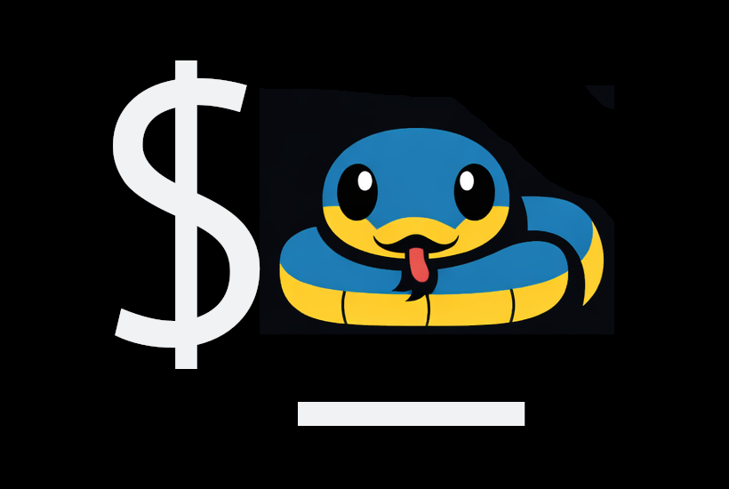

<!--- BADGES: START --->

[][#license-gh-package]

<!-- [][#pypi-package] -->
<!-- [][#pypi-package] -->

[#license-gh-package]: https://www.gnu.org/licenses/agpl-3.0.en.html#license-text
<!-- [#pypi-package]: https://pypi.org/project/py_bash/ -->

<!--- BADGES: END --->

# Py-Bash

## Description

This library simplifies the use of Bash/Shell commands in Python.

## Initial Setup

Prerequisites:

* Install `uv` (if needed):
  * macOS: `brew install uv`
    * If needed, then [install Homebrew](https://brew.sh/)
  * Other: `curl -LsSf https://astral.sh/uv/install.sh | sh`
* Install `make` (if needed):
  * macOS: (built-in)
  * Other: TBD
* Install `python3` (if needed):
  * macOS: `brew install python@3.12` OR `brew install python@3.13` OR `brew install python@3.14`
  * Other: TBD

## Common Operations

* Install project dependencies: `make install`
* Run Tests: `make run-tests`
* Format & Lint: `make lint`
* Format, Lint, and Fix: `make lint-fix`
* Show package version from `VERSION`: `make version-show`
* After tagging `v*`, verify tag matches `VERSION`: `make version-check-tag`

## Versioning

Releases follow [SemVer](https://semver.org/).
The canonical version string is the repo-root `VERSION` file (which contains no `v` prefix).
Git tags use a `v` prefix (e.g., `v0.2.0`). Packaging reads `VERSION` via `pyproject.toml` dynamic metadata.

To cut a release: bump `VERSION` on a branch, open a PR, and merge to `main`.
When `VERSION` changes on `main`, the **Tag release from VERSION** workflow
(`.github/workflows/tag-on-version.yml`) creates an annotated tag `vX.Y.Z` on that commit and pushes it if that
tag does not already exist on the remote.

After a tag exists (or locally before pushing), `make version-check-tag` can be run to confirm the current `v*`
tag matches `VERSION`. CI runs `scripts/verify_version_matches_tag.py` on tag pushes for the same check.
